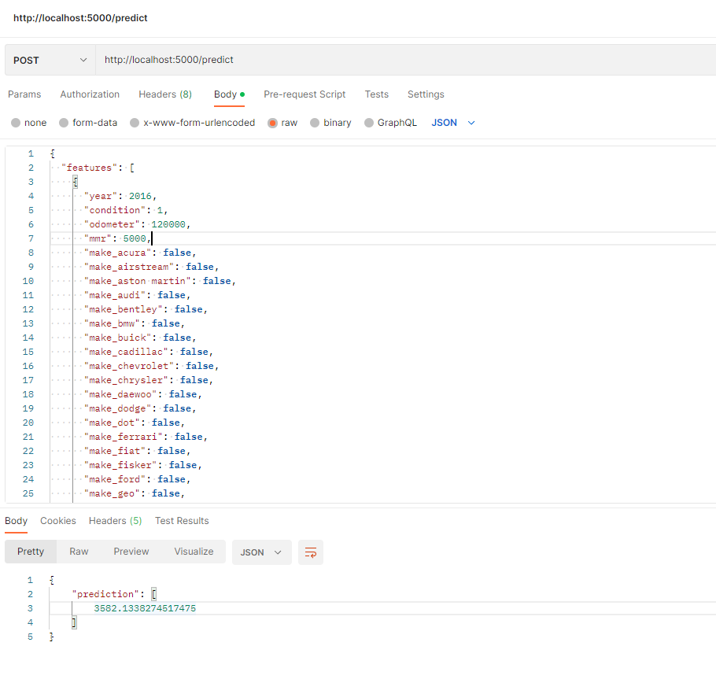

# devcontainer

`.devcontainer` folder toevoegen met daarin `devcontainer.json` file erin:
````
// python slim base image 
{
  "name": "mlops-project-jarno",
  "image": "python:3.10-slim",
  
  // post create command voor het installeren van GIT in de devcontainer want hierin zit geen git, enkel op mijn lokale machine. Het kan zijn dat git bij in de image zit maar omdat het gaat om de slim variant is het de meest basic versie zonder extra dingen. 
  
  "postCreateCommand": "apt-get update && apt-get install -y git && pip install --no-cache-dir -r requirements.txt",
  "extensions": [
    "ms-python.python",
    "ms-vscode.remote-repositories" // enkele custom extentions
  ],
  "forwardPorts": [5000], // poorten forwarden die je nodig hebt
  "settings": {
    "python.formatting.provider": "black"
  }
}

````
more info: https://xebia.com/blog/how-to-create-a-devcontainer-for-your-python-project/

# git 

via postcreate command in devcontainer.json wordt git geinstalleerd in de container zelf, je kan niet verwijzen naar de installatie op de windows machine omdat er vanuit de container zelf connectie wordt gemaakt. de standaard python:slim image bevat geen standaard git installatie

in de docker workspace terminal:
````
git config --global user.email "jarno.desmedt@live.be"
git config --global user.name "Jarno De Smedt"
````
om te kunnen committen vanuit de terminal of vscode extention

# tracking URI


ok perfect, i changed the tracking URI from mlflow.set_tracking_uri("sqlite:///mlflow.db") to mlflow.set_tracking_uri("http://localhost:5001") but i saw somewhere that you needed to use mlflow.set_tracking_uri("sqlite:///mlflow.db") if using docker compose, why don't we need it now? and when do we need it like that?

---


Great question — understanding **when to use `sqlite:///mlflow.db` vs. `http://localhost:5001`** is crucial for MLflow projects, especially when using Docker Compose.


## ✅ What Do These URIs Actually Mean?

### 🔹 `sqlite:///mlflow.db`
This refers to a **local SQLite database file** and is used as a **backend store** for MLflow — *by the MLflow server*, not your training script.

> **This URI is set in your `mlflow` Docker service.**  
> It's not for clients like `train_streamlined.py`, but for configuring how MLflow stores run metadata.

Example in `docker-compose.yml`:
```yaml
mlflow:
  command: mlflow server \
           --backend-store-uri sqlite:///mlflow.db \
           --default-artifact-root /mlflow/mlruns \
           --host 0.0.0.0
```

🧠 It tells **MLflow server**:  
> "Store metadata (runs, experiments, etc.) in a local SQLite file."

---

### 🔹 `http://localhost:5001`
This is the **tracking URI for clients** (like your training script).  
It tells the script:
> “Send all tracking data to the MLflow server running on `localhost:5001`.”

So in your Python code:
```python
mlflow.set_tracking_uri("http://localhost:5001")
```

Means:  
> “Connect to the MLflow server on that address and log the run there.”

---

## ✅ Summary of Roles

| URI                            | Used Where             | Purpose                                      |
|--------------------------------|------------------------|----------------------------------------------|
| `sqlite:///mlflow.db`         | In `mlflow` container  | Backend storage (metadata DB)                |
| `http://localhost:5001`       | In training scripts    | Client → Server communication for tracking   |

---

## 🚫 When *Not* to Use `sqlite:///mlflow.db` in Code

- If you set this **in your script**, it will attempt to use a **local file DB** (in your dev container or host), and **bypass** your running MLflow server.
- You'll end up with **two separate tracking stores** and a very confusing UI experience.

---

## ✅ TL;DR

- Use `mlflow.set_tracking_uri("http://localhost:5001")` in your Python code.
- Use `sqlite:///mlflow.db` in Docker Compose (for the MLflow service backend).
- Never use `sqlite:///mlflow.db` in your script unless you're running MLflow in-process and locally (not via the server).

---

Let me know if you want to move to the next step — wrapping your training pipeline with **Prefect orchestration**!


# prefect

1. in terminal: `prefect server start` => http://127.0.0.1:4200/
2. in another terminal: `prefect config set PREFECT_API_URL=http://127.0.0.1:4200/api`
3. after that, register and run the flow with: 

````
prefect deployment build train_and_register_model.py:training_pipeline -n "Training Pipeline"
prefect deployment apply training_pipeline-deployment.yaml
prefect agent start --pool default-agent-pool
````

1. On one terminal:

    ```shell
    prefect server start
    ```

2. On another terminal, go to the root directory of the repository.

3. On that terminal run:

    ```shell
    prefect init -> 'no i will use the default deployment configuration'
    (prefect deploy my_script.py:main_flow_function -n taxi1 -p zoompool)
    prefect deploy train_and_register_model.py:training_pipeline -n "Training Pipeline" -p "zoompool"
    export PREFECT_API_URL=http://127.0.0.1:4200
    prefect worker start --pool "zoompool"
    ```

4. On the Prefect UI, click on `Flows` > `main-flow` > `Deployments` > `taxi1` and then on `Quick run` on the dots:

    


# flask app

````python
    #when using a stage, use models:/<model_name>/<stage> Just make sure MODEL_STAGE is exactly one of:
    # "None" (literally this string, if you don't want to use a stage)
    # "Production"
    # "Staging"
    # "Archived"
    #model = mlflow.pyfunc.load_model(f"models:/{MODEL_NAME}/{MODEL_STAGE}")
    
    #When using a version number, use model_uri parameter models:/<model_name>/<version_number>
    print(f"Loading model from: models:/{MODEL_NAME}/versions/1")
    model = mlflow.pyfunc.load_model(model_uri="models:/car-price-model/1")
    print("✅ Model loaded successfully!")

    # or with alias if you have set it in the MLflow UI
    #print(f"Loading model from: models:/{MODEL_NAME}/champion")
    #model = mlflow.pyfunc.load_model(f"models:/{MODEL_NAME}/champion")
````

To run the app locally, use the command: python app.py (maar is niet nodig via docker compose want runt al vanzelf)

Send a request like this to /predict (http://localhost:5000/predict):
````json
{
  "features": [2016, 120000, 1.6, 5]
}
````
=> werkt nog niet helemaal want de make column wordt geencodeerd in de model training, en geeft errors in het infer schema.

Hierdoor dus een volledige json nodig met alle makes, zoals hieronder:
````json
{
  "features": [
    {
      "year": 2016,
      "condition": 1,
      "odometer": 120000,
      "mmr": 5000,
      "make_acura": false,
      "make_airstream": false,
      "make_aston martin": false,
      "make_audi": false,
      "make_bentley": false,
      "make_bmw": false,
      "make_buick": false,
      "make_cadillac": false,
      "make_chevrolet": false,
      "make_chrysler": false,
      "make_daewoo": false,
      "make_dodge": false,
      "make_dot": false,
      "make_ferrari": false,
      "make_fiat": false,
      "make_fisker": false,
      "make_ford": false,
      "make_geo": false,
      "make_gmc": false,
      "make_honda": false,
      "make_hummer": false,
      "make_hyundai": false,
      "make_infiniti": false,
      "make_isuzu": false,
      "make_jaguar": false,
      "make_jeep": false,
      "make_kia": false,
      "make_lamborghini": false,
      "make_landrover": false,
      "make_lexus": false,
      "make_lincoln": false,
      "make_lotus": false,
      "make_maserati": false,
      "make_mazda": false,
      "make_mercedes": false,
      "make_mercury": false,
      "make_mini": false,
      "make_mitsubishi": false,
      "make_nissan": false,
      "make_oldsmobile": false,
      "make_plymouth": false,
      "make_pontiac": false,
      "make_porsche": false,
      "make_ram": false,
      "make_rolls-royce": false,
      "make_saab": false,
      "make_saturn": false,
      "make_scion": false,
      "make_smart": false,
      "make_subaru": false,
      "make_suzuki": false,
      "make_tesla": false,
      "make_toyota": false,
      "make_volkswagen": false,
      "make_volvo": true
    }
  ]
}
````



# 


# 