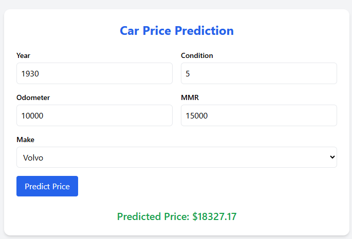

1) open folder in VS code via een terminal met met `code .`
2) ctrl + shift + p -> 'rebuild and reopen in container'
je zal merken dat de containers worden gecreeerd en de devcontainer wordt geopend in vscode
3) nu kan je een terminal openen, zorg dat je in de workspace directory zit (normaal wordt deze standaard geopend) en dat je 'root@92383d3fe9ce:/workspace#' ziet.
Daarin kan je `python train_and_register_model.py` uitvoeren, het model wordt hiermee getraind en gelogd in MLflow.
4) navigeer naar http://localhost:5001/ om het MLflow experiment te bekijken
5) navigeer naar http://localhost:5000/ om te verifieren dat de webapp draait
6) test of je met het geregistreerde model van MLflow kan voorspellen.

- Dit kan via postman door een post request doen op het http://localhost:5000/predict endpoint, met volgende payload:

````json
{
  "features": [
    {
      "year": 2016,
      "condition": 1,
      "odometer": 120000,
      "mmr": 5000,
      "make_acura": false,
      "make_airstream": false,
      "make_aston martin": false,
      "make_audi": false,
      "make_bentley": false,
      "make_bmw": false,
      "make_buick": false,
      "make_cadillac": false,
      "make_chevrolet": false,
      "make_chrysler": false,
      "make_daewoo": false,
      "make_dodge": false,
      "make_dot": false,
      "make_ferrari": false,
      "make_fiat": false,
      "make_fisker": false,
      "make_ford": false,
      "make_geo": false,
      "make_gmc": false,
      "make_honda": false,
      "make_hummer": false,
      "make_hyundai": false,
      "make_infiniti": false,
      "make_isuzu": false,
      "make_jaguar": false,
      "make_jeep": false,
      "make_kia": false,
      "make_lamborghini": false,
      "make_landrover": false,
      "make_lexus": false,
      "make_lincoln": false,
      "make_lotus": false,
      "make_maserati": false,
      "make_mazda": false,
      "make_mercedes": false,
      "make_mercury": false,
      "make_mini": false,
      "make_mitsubishi": false,
      "make_nissan": false,
      "make_oldsmobile": false,
      "make_plymouth": false,
      "make_pontiac": false,
      "make_porsche": false,
      "make_ram": false,
      "make_rolls-royce": false,
      "make_saab": false,
      "make_saturn": false,
      "make_scion": false,
      "make_smart": false,
      "make_subaru": false,
      "make_suzuki": false,
      "make_tesla": false,
      "make_toyota": false,
      "make_volkswagen": false,
      "make_volvo": true
    }
  ]
}
````

of het kan via de GUI op de indexpagina van de webapp (http://localhost:5000/)



Je zal merken dat wanneer je het jaartal echt laag zet zoals 1950 dat de prijs hoger is dan 1995 wat kan wijzen op een meer zeldzame auto en dus hogere waardebepaling.

7) om de unit tests uit te voeren voer je `pytest` uit in een terminal, ook in de workspace folder.
