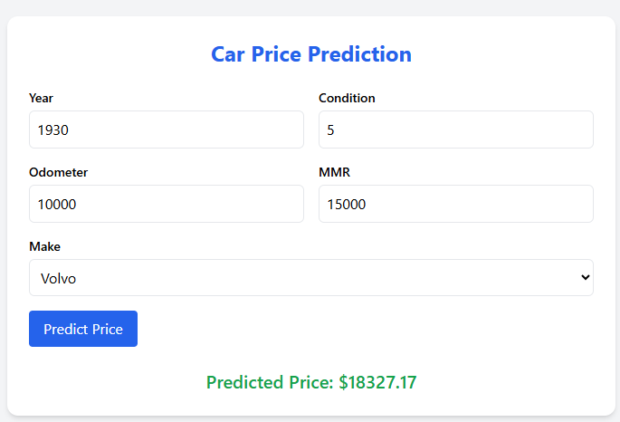

# Project MLops Jarno De Smedt
Github repo: https://apwt.gitbook.io/ba-tiai-ml-ops/projects/project-1

## Inhoudstafel

- [Dataset](#dataset)
- [Project Explaination](#project-explanation)
- [Flows & Actions](#flows--actions)
- [Troubleshooting](#troubleshooting)

## Dataset

https://www.kaggle.com/datasets/bhupendram/carprices

**size**: 88.05 MB, 550298 lijnen
**algoritme**: lineair regression

Deze dataset bevat informatie over prijzen uit de 2ehands automarkt. De dataset zal worden opgesplitst in een training- en testset, verder kan er ook getest worden door manuele input volgens wat er op 2ehands te vinden is.

Nieuwe data om in de toekomst te hertrainen kan eventueel bekomen worden door webscraping van 2ehands sites of manuele input.


## Project Explanation

Aan de hand van een aantal belangrijke kerngegevens van een auto zal het machine learning algoritme een gerichte prijs adviseren op basis van de trainingsdata. De service wordt via een webapplicatie ter beschikking gesteld aan het publiek.

Deze geschatte prijs kan een verkoper gebruiken bij het bepalen van de vraagprijs of een potentiele koper gebruiken om te weten of dit een realistische vraagprijs is. Zo weet je als consument of je niet teveel zal betalen.


## Flows & Actions

In dit project zijn er een heel aantal stappen. hieronder een overzicht van wat geimplementeerd is:

- [x] data exploratie
- [x] data cleaning
- [x] opzetten van een development omgeving met een devcontainer
- [x] ml algoritme implementeren
- [x] ml experiments tracken met MLflow
- [x] orchestreren met prefect
- [x] unit testing
- [x] pre-commit hooks toevoegen
- [x] readme docs how to run
- [x] flask webapp

Volgende zaken zijn voor verdere uitbreiding. Wegens tijdgebrek ben ik hier niet aan kunnen starten:

- [ ] Inferschema aanpassen zodat bij een voorspelling niet alle encoded makes moeten worden meegegeven waarvan eentje op `true` gezet. De bedoeling is dat je 1 make meegeeft en dat dit via de encoder wordt omgezet in de juiste input voor het model.
- [ ] Ik heb momenteel maar 1 flow namelijk de `training_pipeline()` uit `train_and_register_model.py`. Deze zou nog moeten worden opgesplitst in de afzonderlijke files in de `./src` folder.
- [ ] visualiseren met Grafana en Prometheus en tresholds
- [ ] triggers/alerts implementeren bij detecteren van datadrift

## How to run

1. Vereisten

    - Zorg ervoor dat je Docker hebt geinstalleerd en draait. In windows: open Docker Desktop

2. Clone de repository

    ```bash
    git clone <repository-url_zie-bovenaan-readme>
    cd <repository-folder>
    ```

    - Open deze folder in vscode. Dit kan met het commando `code .` in de repository-folder

3. Environment variabelen

    - Maak een `.env` file aan in de root directory van het project.
    - Plak hetvolgende in de `.env` file:
    ```
    POSTGRES_USER=prefect
    POSTGRES_PASSWORD=prefect
    POSTGRES_DB=prefect
    POSTGRES_PORT=5432
    ```

4. Project starten

    - In vscode: `ctrl + shift + p` -> `rebuild and reopen in container`

    - Je zal merken dat de containers worden gecreeerd en de devcontainer wordt geopend in vscode. In Docker desktop zie je dat de containers runnen. Daar kan je de logs bekijken voor elke container.
    > LET OP: het kan zijn dat de prefect-agent container niet goed opstart en daarom moet je deze manueel nog eens starten. Dit kan in Docker Desktop op de reload knop rechts bovenaan.

    - Wanneer alles is opgestart kan je de services bekijken:
        - navigeer naar http://localhost:5001/ om het MLflow experiment te bekijken
        - navigeer naar http://localhost:5000/ om de webapp te bekijken
        - navigeer naar http://localhost:4200/ om de Prefect flow te bekijken.

    - **belangrijk** Je zal merken dat er nog niets in deze services is geregistreerd. Zo is Prefect bijvoorbeeld nog leeg en bevat het geen deployments. Daarom moet je eerst de flow nog deployen naar prefect. Dit doe je als volgt:

        - Open een terminal in vscode. Zorg dat je in de ``/workspace`` directory zit (normaal wordt deze standaard geopend). Verifieer dat je `root@92383d3fe9ce:/workspace#` in de terminal ziet.

        - **Als de prefect.yaml file nog niet bestaat** in de project root folder, creer dan een door `prefect init` uit te voeren in een terminal in de project root folder (``/workspace``) -> kies 'local' in het keuzemenu.

        - Eens je een prefect.yaml file hebt, zorg dan dat de worker runt. Dit kan met hetvolgende commando maar dan draait de worker lokaal in de devcontainer. **BETER** via Docker Desktop de prefect-agent restarten. Check de logs eerst van de prefect-agent container gezien deze soms wel gewoon runt na de opstart van de devcontainer. Je zou daar iets moeten zien als ``2025-05-23 13:27:58 Worker ProcessWorker 015e952e-965e-4e6e-9f74-79a0bccb676b' started!``. Lukt dit niet, kan je zoals eerder vermeld lokaal in de devcontainer runnen (in de ``/workspace`` terminal) met:

    ```bash
    prefect worker start --pool "zoompool"
    ```

    - Deploy de flow nu naar Prefect zodat deze hierin kan worden bijgehouden. Open een terminal in vscode (opnieuw verifieer dat je in de ``/workspace`` directory zit) en voer hetvolgende uit:

    ```bash
    prefect deploy train_and_register_model.py:training_pipeline -n cars1 -p zoompool
    ```
    - Wanneer er gevraagd wordt om een schedule in te stellen, kies 'n'

    - Voer nu de pipeline uit:

        - Open een terminal (verifieer ``/workspace``)
        - Daarin kan je het script uitvoeren door `python train_and_register_model.py` uit te voeren. Het model wordt hiermee getraind en gelogd in MLflow. Ook in prefect zie je het verloop van deze run.

5. Services bekijken

    - navigeer naar http://localhost:5001/ om de output van het MLflow experiment te bekijken. Je zal merken dat er een experiment is bijgekomen onder `CarPricePrediction` en dat er een model geregistreerd is in de `Models` tab bovenaan.
    - navigeer naar http://localhost:5000/ om de webapp te bekijken
    - navigeer naar http://localhost:4200/ om de Prefect flow te bekijken. Je kan de flow run bekijken bij `Runs`. Je kan ook via de UI de flow nog eens uitvoeren door:
        -  klik op `Flows` > `main-flow` > `Deployments` > `cars1` en dan op `Quick run` via de 3 dots rechts

        - LET OP!: worker "zoompool" moet runnen! Check status bij `Work pools` is groen ('Ready')

6. Voorspelling maken via de webapp
    - Open http://localhost:5000/ in een browser.

    

    >Je zal merken dat wanneer je het jaartal echt laag zet zoals 1950 dat de prijs hoger is dan 1995 wat kan wijzen op een meer zeldzame auto en dus hogere waardebepaling.

7. Unit tests uitvoeren

    - Open een terminal in de root directory van het project `/workspace` en voer `pytest` uit.

8. Precommit hooks
    - De hooks in de .pre-commit-config.yaml worden automatisch uitgevoerd bij het committen. Je kan ook een precommit hook manueel uitvoeren. Bijvoorbeeld Pylint:

    ````
    pre-commit run pylint --all-files
    ````

    Dit geeft je een score van de code.

8. Evidently

    - Er zal door een task in de prefect workflow een html file worden gecreerd in de reports folder. De HTML file kan je openen in een webbrowser om te kijken of er datadrift optreedt in de nieuwe data.


## Troubleshooting

> :bulb: **Tip:** Als je bovenstaande stappen correct volgt zou het project vanzelf moeten runnen. Als je toch tegen een aantal problemen botst raad ik aan de docker logs eens te bekijken in de containers (dit kan via de terminal of via Docker Desktop in Windows)

### Prefect

Als de prefect.yaml, zoompool nog niet bestaat of de pipeline flow nog niet is geregistreerd op prefect:

````
prefect init -> kies local in het keuzemenu (is enkel nodig als er geen prefect.yaml file in de root directory bestaat)

prefect worker start --pool "zoompool"

prefect deploy train_and_register_model.py:training_pipeline -n cars1 -p zoompool
````
